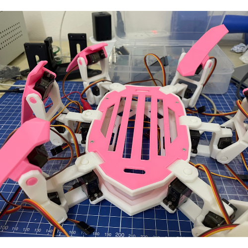

ESP8266 + NRF24L01 and Servo2040

Hexapod controller

The 3d printed parts are from: [RC-Hexapod-link](https://www.instructables.com/Afordable-PS2-Controlled-Arduino-Nano-18-DOF-Hexap/)

Hexapod Assembled:

Controller Assembled:

